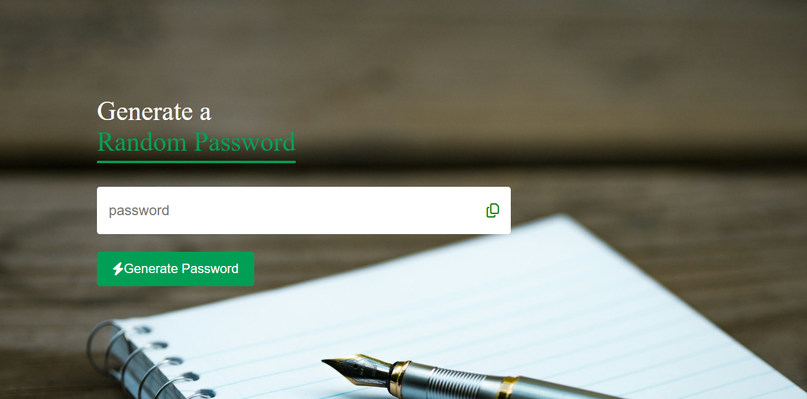

# Password Generator



This project is a simple and user-friendly random password generator built with HTML, CSS, and JavaScript. It allows users to quickly generate secure passwords and copy them to the clipboard for use.

## Features

- **Random Password Generation:** Generates a 15-character password containing uppercase letters, lowercase letters, numbers, and symbols.
- **Copy to Clipboard:** Easily copy the generated password with a single click.
- **Responsive Design:** The interface is styled for clarity and ease of use, with a visually appealing background and FontAwesome icons.

## Getting Started

1. **Clone or Download the Repository**

   Download the project files to your local machine.

2. **Open the Application**

   Open `index.html` in your preferred web browser.

## Usage

- Click the **Generate Password** button to create a new random password.
- Click the copy icon next to the password field to copy the generated password to your clipboard.

## Project Structure

```
index.html
script.js
style.css
fontawesome icon/
images/
webfonts/
```

- `index.html` – Main HTML file for the application.
- `style.css` – Stylesheet for layout and design.
- `script.js` – JavaScript logic for password generation and clipboard functionality.
- `fontawesome icon/` – FontAwesome CSS files for icons.
- `images/` – Contains background and favicon images.
- `webfonts/` – Font files required by FontAwesome.

## Dependencies

- [FontAwesome](https://fontawesome.com/) for iconography.

## License

This project is provided for educational and personal use.
